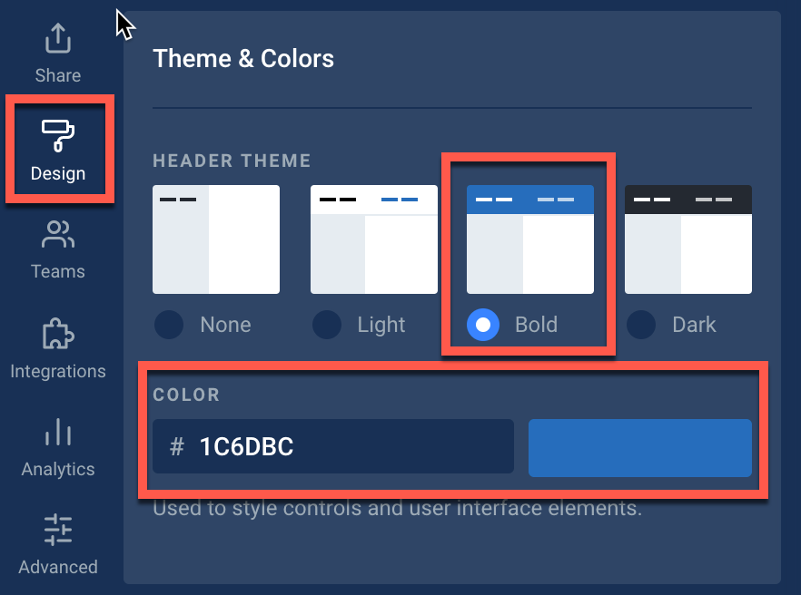
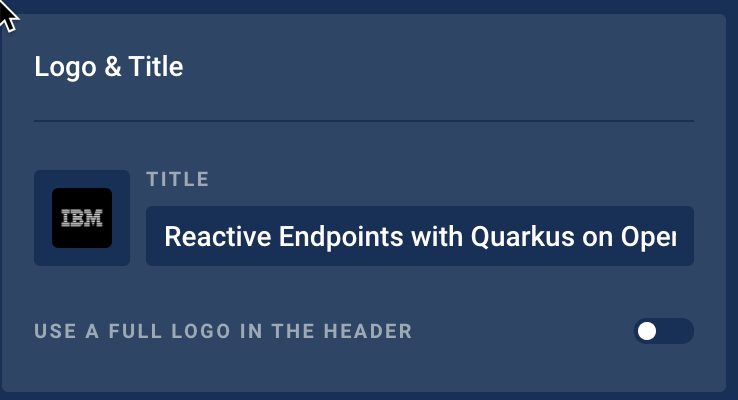
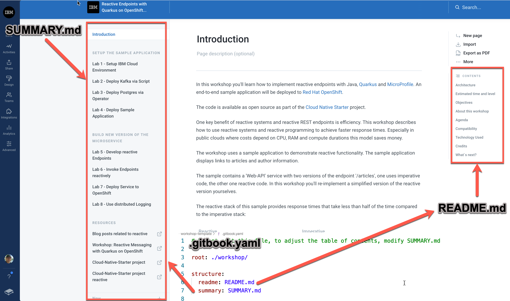

# Advocacy Workshop

This is a template for workshops hosted on Gitbook. To view it online, go to:

<https://ibm-developer.gitbook.io/workshop-template/>

Create a new repo based off this template, and use the folowing folders as a guide:

```ini

- data (any data (CSV, JSON, etc files) to be used)
- notebooks (any Jupyter notebooks can go here)
- src (any application source code can go here)
- workshop (this is where the workshop is documented)
|_ .gitbook (images should go here)
|_ <folder-n> (these are exercises for the workshop)
  |_README.md (the steps for the exercise, in Markdown)
|_ README.md (this will appear on the gitbook home page)
|_ SUMMARY.md (this dictates the Table of Contents)
.gitbook.yaml (tells GitBook to only read the stuff in 'workshop')
.travis.yaml (runs markdownlint by default)
README.md (only used for GitHub.com)
```

## Tips and conventions

### Screenshots

Screenshots look better if they are full page.
Use [ImageMagick](https://imagemagick.org) to create a nice border around images with this command:

```bash
magick mogrify -bordercolor gray -border 2
```

### Design in GitBook

To ensure a common design for IBM workshops please use following options:

* Select in `Theme & Colors` the theme: `Bold` and the color: `#1C6DBC`



* Select in `Logo & Title` the IBM logo



### Understand the major GitBook template structure

It is useful to understand the used GitBook structure of this [template](https://docs.gitbook.com/integrations/github/content-configuration#structure).

* [README.md](https://docs.gitbook.com/integrations/github/content-configuration#structure): Each README.md dictates the Table of Contents on the right hand side.
* [SUMMARY.md](https://docs.gitbook.com/integrations/github/content-configuration#summary): This dictates the Table of Contents on the left hand side.
  * [root](https://docs.gitbook.com/integrations/github/content-configuration#root): Path to lookup for your documentation defaults to the root directory of the repository.
* [.gitbook.yaml](https://docs.gitbook.com/integrations/github/content-configuration): You can configure how GitBook should parse your Git repository using the.gitbook.yaml file that must rely on the root of your repository.

The image shows the file names and thier resonsibilities.




