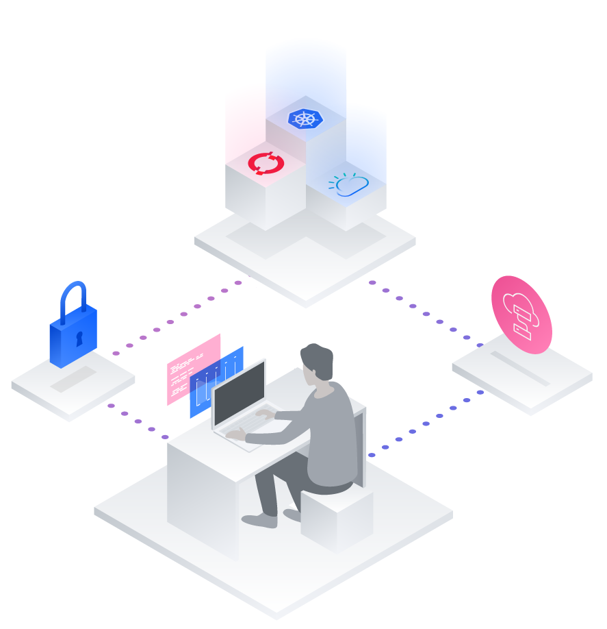

## IBM Developer Interactive Conference - Lab Stream

Welcome to our conference! In this set of workshops we'll be using discussing various concepts of Build Smart Build Secure all while setting up an example application. The goals of this workshop are:

* Goals!
* Have fun!

### About this conference

The introductory page of the workshop is broken down into the following sections:

* [Agenda](#agenda)
* [Compatibility](#compatibility)
* [Technology Used](#technology-used)
* [Credits](#credits)
* [Threat Modeling and Identity Management](#threat-modeling-and-identity-management)
* [Operator Workshop](#operator-workshop)
* [Microservice-Workshop](#microservice-workshop)

## Agenda

|   |   |
| - | - |
| [Exercise 0: Pre-work](pre-work/README.md) | Pre-work for the project |
| [Exercise 1: Some Exercise](some-exercise/README.md) | Exercise to do the thing |

## Compatibility

This workshop has been tested on the following platforms:

* **osName**: version X, version Y

## Technology Used

* Brief Description

## Credits

* [Full Name](https://github.com/githubid)
